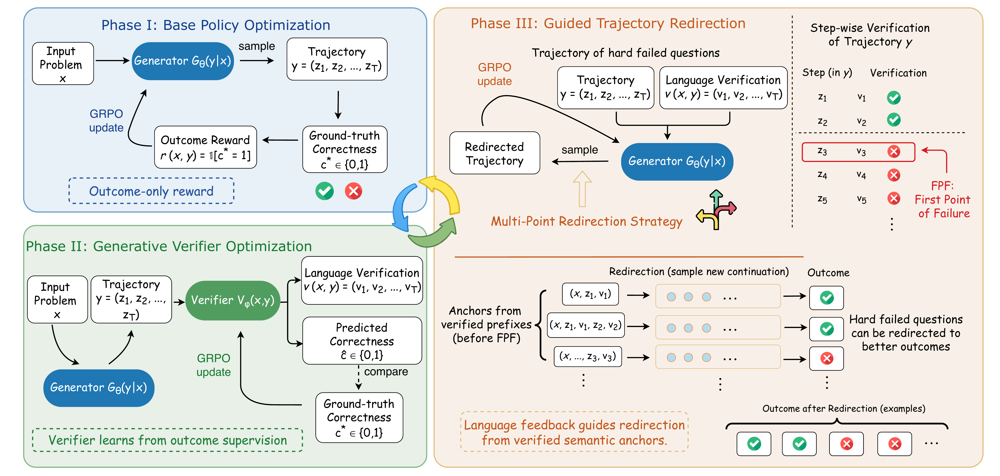
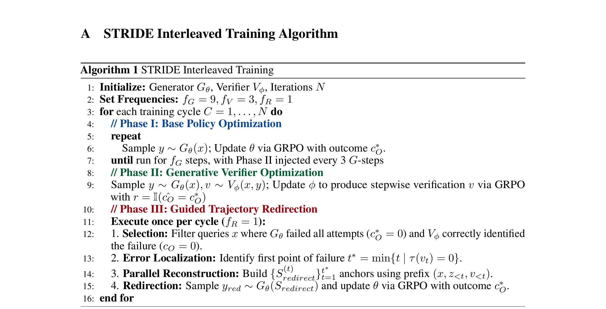

<div align="center">

# STRIDE: Learnable Stepwise Language Feedback for LLM Reasoning

[](https://arxiv.org/abs/2605.18851)
[](LICENSE)
[](https://www.python.org/downloads/release/python-3100/)

<p>
    Junjie Zhang<sup>1</sup>&nbsp;&nbsp;
    Guozheng Ma<sup>1</sup>&nbsp;&nbsp;
    Shunyu Liu<sup>1</sup>&nbsp;&nbsp;
    Zetian Hu<sup>1</sup>&nbsp;&nbsp;
    Yongcheng Jing<sup>1</sup>&nbsp;&nbsp;
    Ting-En Lin<sup>2</sup>&nbsp;&nbsp;
    Yongbin Li<sup>2&dagger;</sup>&nbsp;&nbsp;
    Dacheng Tao<sup>1&dagger;</sup>
</p>

<p>
    <sup>1</sup>Generative AI Lab, College of Computing and Data Science, Nanyang Technological University<br>
    <sup>2</sup>Tongyi Lab, Alibaba Group
</p>

[Paper](https://arxiv.org/pdf/2605.18851) | [Code](https://github.com/pipixiaqishi1/STRIDE)

*Shifting process supervision from scalar rewards to learnable stepwise language feedback — co-training a generator and generative verifier with outcome-only rewards for sustained reasoning improvement.*

</div>

---

## Overview

**STRIDE** shifts process supervision from scalar rewards to *learnable* stepwise language feedback. We co-train a generator and a generative verifier using **only outcome-based rewards**, eliminating external annotations while delivering sustained policy improvement through jointly aligned verifier training. The verifier's stepwise language critiques explicitly localize and explain failures, enabling the generator to redirect reasoning trajectories at intermediate steps toward alternative decisions.

<div align="center">

</div>

---

## Key Highlights

<table>
<tr>
<td width="33%" valign="top">

**Three-Phase Co-Training**

STRIDE operates through an interleaved schedule: *Phase I* builds basic reasoning via GRPO, *Phase II* trains a generative verifier with outcome supervision, and *Phase III* leverages the verifier's language feedback to redirect failed trajectories.

</td>
<td width="33%" valign="top">

**First Point of Failure (FPF) & Multi-Point Redirection**

The verifier localizes the *First Point of Failure* in a reasoning chain. STRIDE then constructs multiple anchor samples from verified prefix steps, guiding the generator to explore alternative paths from semantically grounded restart points.

</td>
<td width="33%" valign="top">

**Outcome-Only Reward Grounding**

All gradient updates are strictly tied to final correctness. This design guarantees *harmless policy improvement* even under noisy or suboptimal verifier feedback, and achieves breakthroughs on zero-pass-rate problems where scalar methods yield no learning signal.

</td>
</tr>
</table>

---

## Main Results

> Zero-shot Pass@1 accuracy. STRIDE achieves state-of-the-art performance among 7B/8B-scale models across both mathematical and out-of-domain reasoning benchmarks.

| Model | MATH500 | AIME 2024 | AIME 2025 | AMC 2023 | Olympiad Bench | Math Avg. | BGQA | CRUX Eval | Strategy QA | Table Bench | OOD Avg. |
|:---|:---:|:---:|:---:|:---:|:---:|:---:|:---:|:---:|:---:|:---:|:---:|
| *Qwen2.5-7B-SFT* | | | | | | | | | | | |
| &nbsp;&nbsp;+ GRPO | 74.6 | 13.3 | 13.3 | 50.0 | 36.9 | 37.0 | 55.3 | 48.8 | 88.1 | 38.2 | 57.6 |
| &nbsp;&nbsp;+ TANGO | 81.4 | 20.0 | 20.0 | 65.0 | 43.9 | 46.1 | 60.5 | 51.4 | 90.0 | 42.3 | 61.1 |
| &nbsp;&nbsp;+ **STRIDE (Ours)** | **84.6** | **26.7** | **23.3** | **75.0** | **46.1** | **51.1** | **66.8** | **57.0** | **92.0** | **43.8** | **64.9** |
| *Llama3.1-8B-SFT* | | | | | | | | | | | |
| &nbsp;&nbsp;+ GRPO | 66.8 | 6.6 | 6.6 | 47.5 | 34.2 | 32.3 | 48.2 | 45.5 | 84.6 | 30.8 | 52.3 |
| &nbsp;&nbsp;+ TANGO | 69.2 | 6.6 | 6.6 | 50.0 | 35.0 | 33.5 | 49.0 | 45.3 | 86.0 | 28.9 | 52.3 |
| &nbsp;&nbsp;+ **STRIDE (Ours)** | **70.4** | **13.3** | **10.0** | **50.3** | **36.0** | **36.0** | **50.2** | **46.0** | **88.2** | **32.3** | **54.2** |

---

## Installation

```bash
git clone https://github.com/pipixiaqishi1/STRIDE.git
cd STRIDE

conda create -n stride python==3.10
conda activate stride
pip install -e '.[vllm]'
pip install ninja
pip install flash-attn --no-build-isolation
```

---

## Data Preparation

```bash
# Training datasets
python data_preprocess/eurus2_sft.py
python data_preprocess/eurus2_rl.py

# Evaluation datasets
mkdir -p ./data/StrategyQA
wget -P ./data/StrategyQA https://huggingface.co/datasets/voidful/StrategyQA/resolve/main/strategyqa_train.json
python data_preprocess/prepare_strategyqa.py

mkdir -p ./data/TableBench
wget -P ./data/TableBench https://huggingface.co/datasets/Multilingual-Multimodal-NLP/TableBench/resolve/main/TableBench.jsonl

python data_preprocess/prepare_eval_benchmarks.py
```

---

## Training

We run experiments on **8 x H20 GPUs**. Other configurations may also work.

### Stage 1: SFT

```bash
# Set up Ray cluster (on all nodes)
export VLLM_ATTENTION_BACKEND=XFORMERS
ray start --head                                    # master node
ray start --address ${MASTER_NODE_ADDRESS}:6379      # worker nodes

# Generate SFT data (on master node)
bash scripts/run_sft_data_generation.sh

# Split into train/test
python data_preprocess/split_parquet.py \
    --input ./data/eurus2_sft_math/llama70b_sft_data_generation.parquet

# Run SFT training (on each node i=0,1,2,3)
bash scripts/run_sft_generator.sh --nnodes 4 --node_rank ${i} \
    --master_addr ${MASTER_NODE_ADDRESS}
```

### Stage 2: STRIDE

```bash
# Set up Ray cluster (same as above)
export VLLM_ATTENTION_BACKEND=XFORMERS
ray start --head
ray start --address ${MASTER_NODE_ADDRESS}:6379

# Launch STRIDE training (on master node)
bash scripts/run_stride.sh <sft_model_checkpoint_path>
```

The training script implements the three-phase interleaved schedule:

<div align="center">

</div>

---

## Evaluation

Evaluation on all benchmarks (MATH500, AIME 2024/2025, AMC 2023, OlympiadBench, BGQA, CRUXEval, StrategyQA, TableBench) is performed **automatically during training** at the interval specified by `TEST_FREQ` in the training script.

---

## Core Files

| File | Description |
|:---|:---|
| [`verl/trainer/main_stride.py`](verl/trainer/main_stride.py) | Entry point: Ray setup, reward manager, resource pools |
| [`verl/trainer/ppo/stride_trainer.py`](verl/trainer/ppo/stride_trainer.py) | Core trainer with three-phase co-training schedule |
| [`verl/workers/verifier_worker.py`](verl/workers/verifier_worker.py) | Verifier worker: FPF localization, Multi-Point Redirection |
| [`verl/trainer/config/stride_trainer.yaml`](verl/trainer/config/stride_trainer.yaml) | Hydra configuration for STRIDE training |
| [`data_preprocess/system_prompt.py`](data_preprocess/system_prompt.py) | Prompt templates for generator, verifier, and redirection |

---

## Acknowledgements

Our codebase is built on [veRL](https://github.com/volcengine/verl) and [RL-Tango](https://github.com/kaiwenzha/rl-tango). Special thanks to these great infrastructures.

---

## Citation

If you find our work useful, please consider citing:

```bibtex
@article{zhang2025stride,
    title={STRIDE: Learnable Stepwise Language Feedback for LLM Reasoning},
    author={Zhang, Junjie and Ma, Guozheng and Liu, Shunyu and Hu, Zetian and Jing, Yongcheng and Lin, Ting-En and Li, Yongbin and Tao, Dacheng},
    journal={arXiv preprint arXiv:2605.18851},
    year={2025}
}
```
